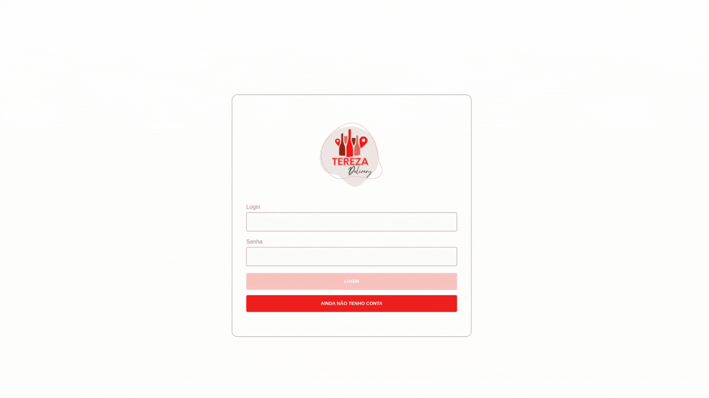
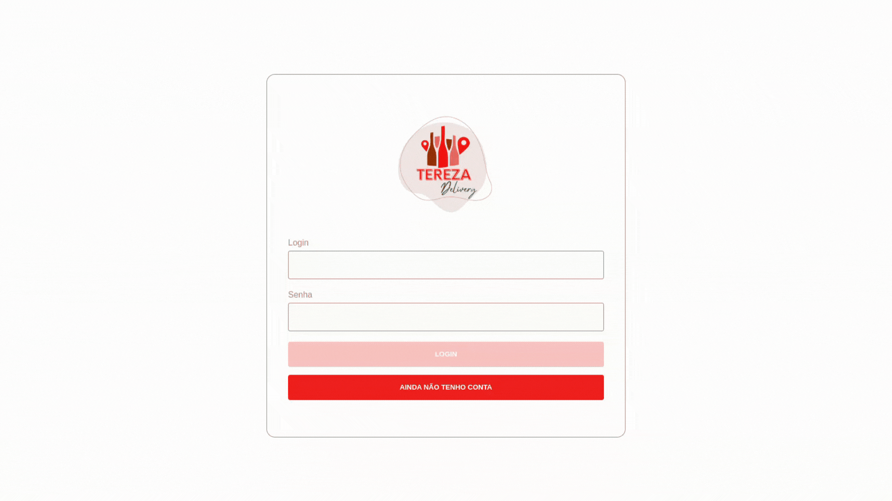
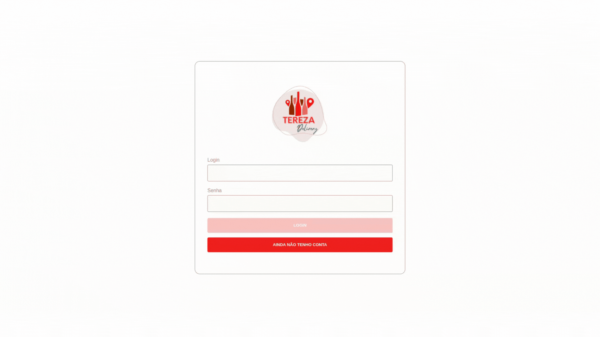

# Boas vindas ao repositório do projeto App de Delivery!

**Este foi um projeto em grupo realizado durante o meu curso na Trybe, onde foi desenvolvido um app de delivery para uma distribuidora de bebidas.**

  A distribuidora de cervejas da dona Tereza está se informatizando! 🚀 Seu negócio, antes focado em um local específico da cidade, passou a receber uma quantidade massiva de encomendas de outros pontos, expandindo sua atuação via delivery. Isso tudo graças ao excelente preço das bebidas e atendimento da equipe de vendas.

  Agora a distribuidora possui alguns pontos de venda na cidade para agilizar no atendimento dessas áreas. Cada ponto de venda, por sua vez, possui uma pessoa vendedora responsável.

  Como seu antigo sistema, que era um conjunto de planilhas, já não atende a necessidade do negócio por gerar muita manutenção, dona Tereza procurou a minha equipe de pessoas desenvolvedoras com uma ideia de aplicativo que pudesse agilizar a vida de sua equipe e das pessoas que compram seus produtos. O aplicativo precisa:

  - Ter acesso via login: tanto clientes como pessoas vendedoras, assim como a própria dona Tereza, que administra o sistema, devem ter acesso ao aplicativo via login, porém para funções diferentes:
  
  (1) A pessoa cliente, que compra da lista de produtos;

    
  
  (2) A pessoa vendedora, que aprova, prepara e entrega;

    
  
  (3) A pessoa administradora, que gerencia quem usa o aplicativo;

    

  
  - Fazer a comunicação entre clientes e pessoas vendedoras: a pessoa cliente faz o pedido via "carrinho de compras" e a pessoa vendedora aprova, prepara e envia esse pedido. Quando o produto é recebido por quem comprou, essa pessoa marca o pedido como "recebido". Ambos devem possuir detalhes sobre seus pedidos;
  - Se a pessoa cliente faz o pedido, o mesmo deve aparecer para a pessoa vendedora em seu dash de pedidos após a atualização da página. A pessoa cliente, por sua vez, deve ter as informações sobre seu pedido quando sua página for atualizada, ou seja, ter informações se o pedido está sendo preparado ou se já saiu pra entrega;

  ###### Projeto desenvolvido por: [Miriam Vidoto](https://github.com/MiriamVidoto) & [Melania Chagas](https://github.com/Melania-Chagas) & [Erika Rocha](https://github.com/erikarg) & [Gabriela Delamare](https://github.com/gabrieladnr) & [Raynara Santiago](https://github.com/raynarastg)
